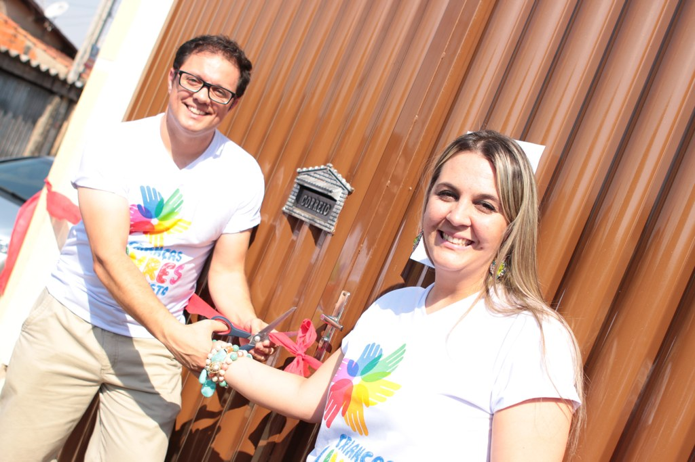

### **HISTÓRIA**

O projeto teve início pelas mãos do casal Fernanda e Willian, que ao chegarem na comunidade do Parque da Liberdade no ano de 2013 em Americana-SP, se depararam com uma triste cena: a de crianças desprotegidas e desorientadas.

O "choque" de realidade veio quando numa simples conversa, Fernanda ouviu de um garotinho "eu não tenho pai!". Após um silêncio doloroso, a reflexão daquela frase ecoava em sua mente: Quantas crianças estão nessa mesma situação? Sem pai? Sem direção? Sem proteção?

Na comunidade, o casal pode ver que as notícias antes só assistidas na TV, de crianças marginalizadas e esquecidas à própria sorte, estavam mais próximas do que se poderia imaginar. Lá viviam crianças que mereciam brincar, estudar e crescer. Mas que infelizmente, foram vítimas da ineficiência e injustiça humana.

Inicialmente em um local improvisado, foi possível proporcionar a Educação Cristã, que é o alicerce para a vida. Mas a necessidade de estar em contato frequentemente com esses jovens, fez com que a cada dia, novos voluntários fossem se juntando ao projeto. O que contribuiu para a fundação de uma sede que abrigasse mais membros.

A ideia foi compartilhada com amigos, e a cada dia mais pessoas foram contribuindo para o desenvolvimento de boas ideias. Até que no dia 12 de outubro de 2014 foi fundada a sede da Alec.

### **O QUE SIGNIFICA ALEC?**

**ALEC** é a sigla para Associação Livres em Cristo. Porém também é um nome originado a partir do grego Aléxandros, que é formado pela junção dos termos aléxo, que significa “proteger”, e andrós, que significa “humano”.

Alec: “protetor e defensor da humanidade”.

### **SOBRE NÓS**

Temos por finalidade mostrar um mundo diferente para as crianças, adolescentes e jovens da nossa comunidade, permitindo que a liberdade possibilite uma nova escolha: a de produzir o bem e criar um mundo melhor.

Queremos que eles sejam livres para serem crianças, brincar, pular, dançar e desenvolver os dons e talentos que cada um de nós temos.

Possuímos hoje cerca de {{ site.inscritos }} inscritos, que além de participarem das mais de 20 atividades oferecidas, recebem uma refeição antes de voltarem para suas casas. Ao todo são servidas {{ site.refeicoes }} refeições por dia.

Este projeto acontece com ajuda de corações generosos, que já somam {{ site.voluntarios }} voluntários, pessoas que doam seu tempo e são responsáveis pela aplicação das atividades, preparo das refeições e manutenção do local.

